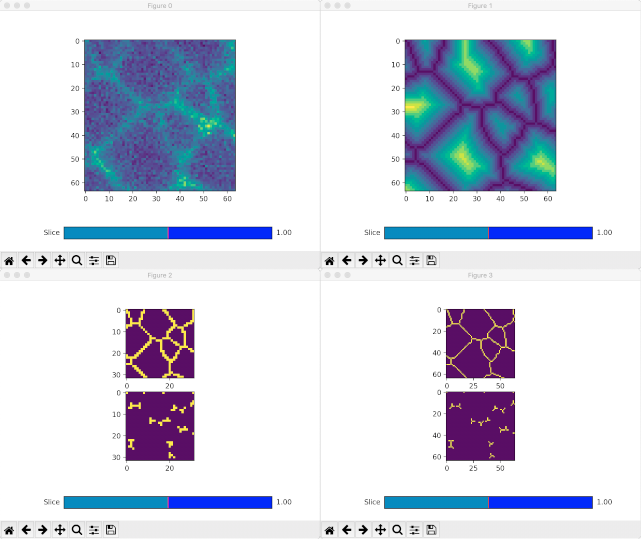

#Cerberus

The cerberus model is a small extension to the UNET model where it uses the 
same structure as the unet, but uses 3 different outputs.

## Quick start.
Create a folder to work in, within that folder there should be two data folders,
originals and labels, which contain the training data.

Create the model

    cerberus create -c cerberus-test.json

Attach training data.

    cerberus attach -c cerberus-test.json

*During this process you can select the names of folders.

Inspect the data source to make sure they're attached correctly.

    cerberus inspect -c cerberus-test.json

Start the model training.

    cerberus train -c cerberus-test.json

Once an epoch has completed the model can be used to make predictions.

    cerberus predict model_name-latest.h5 image_to_predict.tif


## Usage

This section goes through the quick start and menus that popped up to 
describe some of the values used.
    

    cerberus create -c cerberus.json
    
This will go through the cerberus config menu.

### Create Unet menu.

```
input shape                                                                      [
                                                                                   1,
                                                                                   3,
                                                                                   64,
                                                                                   64
                                                                                 ]
kernel shape                                                                     [
                                                                                   3,
                                                                                   3,
                                                                                   3
                                                                                 ]
pooling                                                                          [
                                                                                   1,
                                                                                   2,
                                                                                   2
                                                                                 ]
depth                                                                            3
n filters                                                                        32
model file                                                                       "default-model.h5"
spatial dropout rate                                                             0.0625
                       
                                                      < cancel                                             >< next                                               >
```

- **input shape** is the shape of the input stacks used. It needs to be a 4 
element array as [ channels, depth, height, width ]. So the default shape uses
a 3 slices of a single channel. 
- **kernel shape** Shape of kernel used for convolutions. This is 
[ depth, height, width]. 
- **pooling** For the contraction and expansion accross depth. This significantly
reduces the size of the model.
- **depth** At each depth there are a set of convolutional layers, then a pooling
contraction to the next depth level. 
- **n filters** number of filters at the first depth for the convolutional layer.
- **model file** The filename that the current model will be saved to.

### Cerberus Head Menu.

There are 3 heads that need to be configured, they each follow the same structure.

```
configure head #0

name                                                                             "distance"
n_labels                                                                         1
bits                                                                             6
offset                                                                           2
activation                                                                       "relu"
depth                                                                            0
resampler                                                                        "min pool"
labeller                                                                         "linear labels"
                                                      < cancel                                             >< finished                                           >

```

-**name** for mapping loss functions.
-**n_labels** number of labels, 1 one label for output.
-**bits** number of bits for all of the labels, 6 bits used.
-**offset** bits offset from 0, 2 first two bits of training data ignored.
-**activation** final output activation: "relu" rectified linear function.
-**depth** depth that layer is output at: 0 max resolution.
-**resampler** method of pooling training data. min pool pixel in pooling
size patches.
-**labeller** How the n_labels output are converted to training labels. "linear
labels" is no change for relu output.

```
configure head #1

name                                                                             "membrane-scale"
n_labels                                                                         2
bits                                                                             2
offset                                                                           0
activation                                                                       "sigmoid"
depth                                                                            1
resampler                                                                        "max pool"
labeller                                                                         "multiclass labels"
                                                      < cancel                                             >< finished                                           >
```

-**name** for mapping loss functions.
-**n_labels** number of labels, 2 two labels for output.
-**bits** number of bits for all of the labels, 2 bits used.
-**offset** bits offset from 0, only first 2 bits are used.
-**activation** "sigmoid" value between 0 and 1 thresholded at 0.5.
-**depth** depth of 1, scaled by max pooling.
-**resampler** method of pooling training data. max pool pixel in pooling
size patches.
-**labeller** multiclass labeller that takes two channels and turns them to 
0, 1, 2, or 3. 

```
configure head #2

name                                                                             "membrane-crop"
n_labels                                                                         2
bits                                                                             2
offset                                                                           0
activation                                                                       "sigmoid"
depth                                                                            0
resampler                                                                        "crop"
labeller                                                                         "multiclass labels"
                                                      < cancel                                             >< finished                                           >
```

-**name** for mapping loss functions.
-**n_labels** number of labels, 2 two labels for output.
-**bits** number of bits for all of the labels, 2 bits used.
-**offset** bits offset from 0, only first 2 bits are used.
-**activation** "sigmoid" value between 0 and 1 thresholded at 0.5.
-**depth** depth of 0, scaled by a single pooling.
-**resampler** crops the center of the stack, but depth is zero so it does nothing.
-**labeller** multiclass labeller that takes two channels and turns them to 
0, 1, 2, or 3. 

### Attach a data source

    cerberus attach -c cerberus-test.json
    
Which takes you through the same menu as the attach data source for the basic
unet.

```
enter type: 
1. paired directory
2. weighted directories
3. remove existing sources.
<anything else>. stop
...1
enter images directory: 
enter images directory: original
enter labels directory: labels
enter a list of angles, leave blank if none

[]
labellers: 
  -  0 :  region labels
  -  1 :  multiclass labels
  -  2 :  categorical labels
  -  3 :  double membrane labels
  -  4 :  linear labels
select labeller: 4
enter type: 
1. paired directory
2. weighted directories
3. remove existing sources.
<anything else>. stop
...
save config? ( y/N )y
```
It should use linear labels because the values aren't being split until the
heads, it only works with paired directories.

Once data has been attached it can be inpsected.

    cerberus inspect -c cerberus-test.json
    
For the default config, this will create four matplotlib windows.



    
### Train model

    cerber train -c cerberus-test.json
    
```
update settings

model file                                                                      "default-model.h5"
output file                                                                     "default-model.h5"
initial learning rate                                                           1e-06
optimizer                                                                       "keras.optimizers.Adam"
loss function                                                                   {
                                                                                  "distance": "unetsl.model.logMse",
                                                                                  "membrane-scale": "unetsl.model.sorensenDiceCoefLoss",
                                                                                  "membrane-crop": "unetsl.model.sorensenDiceCoefLoss"
                                                                                }
stride                                                                          [
                                                                                  0,
                                                                                  3,
                                                                                  32,
                                                                                  32
                                                                                ]
batch size                                                                      1
multi-gpu                                                                       false
samples to predict                                                              []
normalize samples                                                               false
validation fraction                                                             0.2
epochs                                                                          2000
loss weights                                                                    {
                                                                                  "distance": 1,
                                                                                  "membrane-scale": 1,
                                                                                  "membrane-crop": 1
                                                                                }
                                                     < cancel                                            >< finished                                          >
```


### Predictions

    cerberus predict model_name.h5 image.tif
    
That will open a prediction menu. 
## Comparison
The UNET model behind cerberus is of the same structure as the original unet
network, the only difference is that there are three different outputs. The
outputs are set at different depths, and can be set to learn the idea behind this is
that the network has to learn features of the image at lower depths. It doesn't
change the structure of the actual unet but it helps to avoid a short circuit of
sorts.

Say you have a depth 3 network, and a depth 5 network. The depth 3 network
will have the exact same structure as the top three depths of a depth 5 network.
The weights can even be copied over. That has two implications: the depth
5 should perform better because we can have a depth 3 and just use the
additional parameters to make some improvement. Suppose if the improvements 
through varying d5 layers were smaller than varying the values in d3, then It 
is possible the network doesn't learn to train layers {4, 5}. One way to ensure
d5 learns something at the lower depths, we can use the output from some of the
lower depths to learn a feature. 
