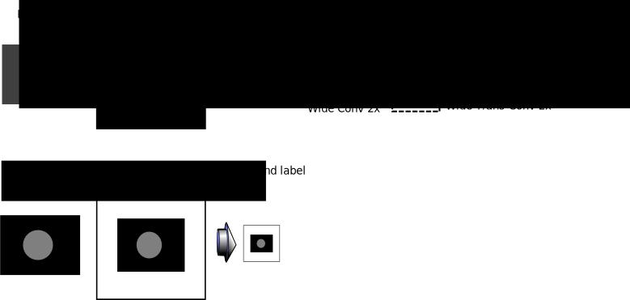

# Mask segmentation.

This is an attempt to explore model structure for finding 'long-range' features.
It uses a fast contracting branch with the goal to produce a low resolution
mask of a feature. Intended to isolate cells colonies that will be used as
a mask for the distance transform work.

## Basic Structure
The basic structure is 

First the input image is padded to a larger size image, so the model can handle
different size images. The padded image is max pooled to 1/3 of the size, then
there are two convolutions with large kernels and large strides to effectivly 
pool the model even more, each of these layers has a small number of filters
essentially the model should learn how to gaussian blur the input image.

Then the data is run through a convolution layer with many filters, but 
maintains the size of the data. 

Finally there are two up-convolutions to get the image back to 1/3 of the input
size.

### Virtual Environment

Create a virtualenv to 